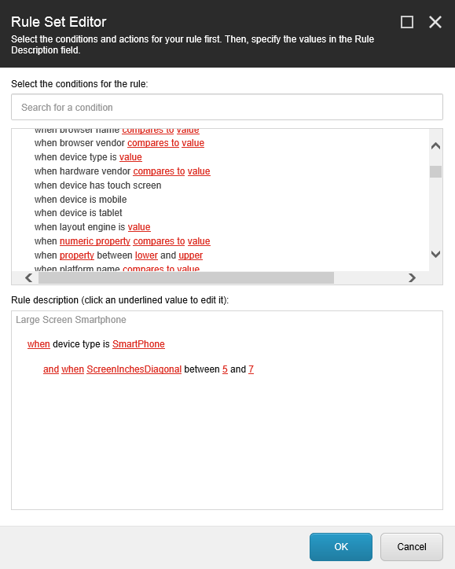
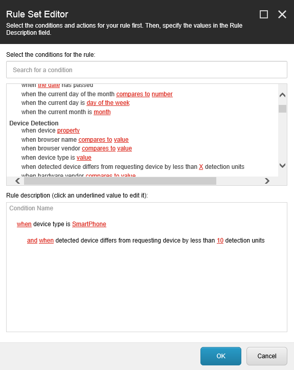

 **51Degrees Device Detection for Sitecore**

[Recent Changes](#recent-changes "Review recent major changes") | [Supported Databases](https://51degrees.com/compare-data-options?AffiliateId=5&utm_source=github&utm_medium=repository&utm_content=home-menu&utm_campaign=sitecore "Different device databases which can be used with 51Degrees device detection") | [Available Properties](https://51degrees.com/resources/property-dictionary?AffiliateId=5&utm_source=github&utm_medium=repository&utm_content=home-menu&utm_campaign=sitecore "View all available properties and values")

Upgrade Sitecore to understand much more about the requesting device. Then adapt content and analytics to optimise the web experience for the device.

**New Sitecore Device Rules & Conditions** including...

* **Device type** covers Smartphone, Tablet, Desktop, eReader, TV and many more
* **Screen size** details of both physical and pixel screen size
* **Has touch screen** flag
* Set **accuracy** thresholds

**plus** supports the full range of 51Degrees properties and values - [genuinely THE worlds fastest and most accurate device detection](https://51degrees.com/device-detection/competitor-comparison?AffiliateId=5&utm_source=github&utm_medium=repository&utm_content=competitors&utm_campaign=sitecore "Compare 51Degrees to Netbiscuits, DeviceAtlas and WURFL")

**Developer** extensions...

Use code like...

```cs
Request.Browser["IsMobile"]
```

or 

```cs
Request.Browser["IsTablet"]
```

... from within a web application server side to determine the requesting device type.

Include...

```
https://[YOUR DOMAIN]/51Degrees.features.js?DeviceType&ScreenInchesDiagonal
```

... from Javascript to retrieve device type and physcial screen size information. Use Google Analytics custom dimensions to add this data for more granular analysis.

## Quick Start

* Download the "Mobile Device Detection.zip" package from this repository or from Sitecore Marketplace
* Install the package into Sitecore - this may take up to 2 minutes to complete
* Use Experience Editor to setup rule set conditions based on device properties
* Publish the new rules from the package to test on different real devices
* Upgrade to 51Degrees Premium or Enterprise device data to get automatic updates including all the latest devices and access to the full range of properties. Use coupon code **3chillies2015** for a 10% discount.

**[Compare Device Databases](https://51degrees.com/compare-data-options?AffiliateId=5&utm_source=github&utm_medium=repository&utm_content=home-cta&utm_campaign=sitecore "Compare different data file options for 51Degrees device detection")**

Note: during testing we have observed that analytics may need to be disabled to allow packages to be installed. Changing the following line in the Sitecore.Analytics.config file may be required to complete the installation.

```
<setting name="Analytics.Enabled" value="false" />
```

### Examples

One of the most common scenarios for device detection involves turning content on or off when displayed on a mobile device. The Rule Set Editor can be used to setup this simple boolean condition from the Device Detection options added by the extension.

 then the rule will evaluate to true")

A more complex rule may involve turning advertising on for Smartphones with diagonal screen dimensions between 5 and 7 inches. The Rule Set Editor easilly supports this requirement by combining the boolean property IsSmartphone with the numeric ScreenInchesDiagonal range property.



Use the difference rule to exclude any results that 51Degrees degrees considers suspect. Values over 10 should typically be treated as suspicious. The following rule only includes the Smartphone condition if the difference between the requesting device and the best available device from 51Degrees is less than or equal to 10.



**[Read Further Use Cases](https://51degrees.com/resources/case-studies?AffiliateId=5&utm_source=github&utm_medium=repository&utm_content=home-cta&utm_campaign=sitecore "Read case studies from eCommerce, gaming, adtech, analysis and research companies")**

## Notes for Developers

### Files & Items

The following files are added to the Sitecore web site:

* bin/FiftyOne.Foundation.dll - device detection provider from 51Degrees
* bin/Sitecore.SharedSource.MobileDeviceDetector.dll - device detection interface to Sitecore
* ../Data/packages/Device Detection.xml - package designer file used to create the package
* App_Data/51Degrees.mobi.config - controls the operation of 51Degrees
* App_Data/51Degrees.dat - database of devices which can be upgraded to support all features
* App_Config/include/Sitecore.SharedSource.MobileDeviceDetector.config - adds device detection to the Sitecore pipelines

The following item locations are altered:

* Settings/Analytics/Lookups/Device Detection - lists of properties and values used by the conditions interface
* Settings/Rules/Definitions/Elements/Device Detection - conditions used with device detection to alter site content
* Settings/Rules/Device Detection - invokes the device detection rules from the page request pipeline
* Templates/System/Analytics/Device Detection - templates for the property and value lookup list items
* Settings/Rules/Conditional Renderings - altered to add Device Detection as a conditional rendering option

### Projects ###

Sitecore.SharedSource.MobileDeviceDetector - assembly which implements the interface between Sitecore and 51Degrees. 

BuildPackage - console application to generate a Sitecore package for Device Detection. This only needs to be used if the conditions need to be changed to meet deployment specific scenarios. The most recent version of 51Degrees Enterprise device data should be used to generate the richest set of conditions and associated meta data items.

The initial version of this extension forked the Mobile Device Detector originally created by Alexander Doroshenko. The upgrade includes support for 51Degrees version 3.2 and Sitecore 8 onwards. It has not been tested with Sitecore versions prior to 8.

### Dependencies ###

MobileDeviceDetector references Sitecore DLLs. These DLL references will need to be resolved prior to building the package.

All device detection functionality is contained in dependency FiftyOne.Foundation.dll added from NuGet. This Sitecore extension does not access values directly but retrieves them via the HttpContext.Current.Request.Browser instance which will have already been overriden by 51Degrees. For more information on 51Degrees see [.NET Device Detection](https://github.com/51Degrees/.NET-Device-Detection).

### Build Package ###

The BuildPackage project is used to generate the package. Templates of all the items are included in the templates folder. Package.zip is an empty device detection package ready to have files and items added to it. 

A 51Degrees device data file is needed to generate the conditions. The Enterprise data file will be used to build a package with the greatest number of properties and values. 

Build package parses the 51Degrees meta data and generates lookup lists and rule conditions. The MobileDeviceDetector project is rebuilt incase any of the condition implementations have changed.

BuildPackage takes the following parameters in order:

1 - Path to the 51Degrees data file

2 - Folder to output the completed package to

3 - Path to the MobileDeviceDetector.csproj file

The file Device Detection.xml can be used as a Package Designer template to create a new package of custom rule conditions.

## Recent Changes

### Version 1.0.0 - Initial Release

Initial fork of the Mobile Device Detector originaly authored by Alexander Doroshenko. Assemblies which are copyright Sitecore and Courier have been removed. As such the package will not build without access to a Sitecore deployment.

Changes include:

* All available properties can be used.
* Added string and numeric operators for different property types.
* Includes difference indicator to set thresholds for detection results.
* Added a content editor warning if enabled and Premium or Enterprise device data are not being used.
* Supports Javascript client side operation.
* Includes all features added in 51Degrees V3.2